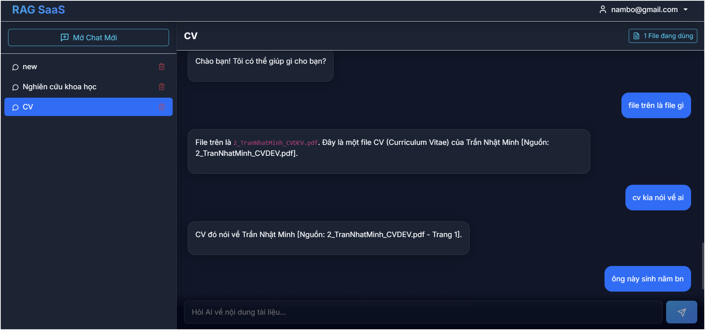

# 🚀 Enterprise AI Legal RAG - Trợ Lý Pháp Lý AI Tự Chủ (Agentic RAG)


**Enterprise AI Legal RAG** là hệ thống giải pháp cho phép người dùng và doanh nghiệp giao tiếp trực tiếp với kho tài liệu Pháp lý nội bộ (Luật, Nghị định, Hợp đồng...) một cách bảo mật, chính xác tuyệt đối và loại bỏ hoàn toàn "ảo giác" (hallucination) của AI nhờ kiến trúc Agentic. 

Dự án áp dụng kiến trúc **Retrieval-Augmented Generation (RAG)** tiên tiến, lấy cảm hứng từ luồng trải nghiệm của **Google NotebookLM**, cho phép người dùng tự do tuỳ biến "Vùng tri thức" cho từng cuộc trò chuyện.

---

## 🎯 1. Bối Cảnh & Giải Pháp

### Vấn đề
- **Tra cứu khó khăn:** Việc tìm kiếm một thông tin cụ thể trong hàng ngàn trang tài liệu tốn quá nhiều thời gian.
- **Hạn chế của AI thông thường:** Các mô hình như ChatGPT/Claude thiếu kiến thức nội bộ của bạn, dễ dàng bịa đặt thông tin khi không biết và tiềm ẩn rủi ro rò rỉ dữ liệu khi tải trực tiếp file lên server công cộng.

### Giải pháp RAG
Thay vì hỏi AI bằng kiến thức chung, hệ thống sẽ:
1. **Trích xuất (Retrieval):** Tìm chính xác đoạn văn bản liên quan nhất từ kho tài liệu của riêng bạn.
2. **Sinh văn bản (Generation):** Ép mô hình AI (Gemini) chỉ được phép trả lời dựa trên những dữ liệu vừa tìm được kèm theo **trích dẫn nguồn và số trang**.

---

## ⚙️ 2. Kiến Trúc Hệ Thống (Architecture)

Hệ thống được thiết kế theo kiến trúc Microservices tinh gọn, dễ dàng mở rộng và chạy hoàn toàn trong container Docker:

- **Frontend:** React (Vite) - Giao diện hiện đại, quản lý hội thoại và kho tài liệu trực quan.
- **Backend:** FastAPI (Python) - Xử lý API tốc độ cao, quản lý xác thực JWT, và điều phối luồng RAG.
- **Database:** PostgreSQL - Lưu trữ thông tin người dùng, lịch sử chat và metadata tài liệu.
- **Vector Database:** Qdrant - Lưu trữ và truy vấn ngữ nghĩa các Vector Embeddings siêu tốc.
- **AI Pipeline (Langchain):**
  - *Mô hình Nhúng (Embedding):* `BAAI/bge-m3` - Mô hình tối ưu hoá cực tốt cho Tiếng Việt, dimension 1024, chạy hoàn toàn cục bộ.
  - *Mô hình Ngôn ngữ (LLM):* `Google Gemini 2.5 Flash` - Tốc độ phản hồi cực nhanh và thông minh.

---

## ✨ 3. Tính Năng Nổi Bật

### 🔐 Quản trị Định danh & Xác thực
- Xác thực bảo mật OAuth2 với **Access Token** & **Refresh Token** (JWT).
- Quản lý phân quyền, đổi mật khẩu, quên mật khẩu và thông tin cá nhân.
- Mật khẩu được băm (hash) an toàn.

### 📂 Quản lý Tài liệu Đa định dạng & Cấu trúc Pháp lý
- Hỗ trợ đa dạng file: `.pdf`, `.docx`, `.xlsx`, `.pptx`, `.png`, `.jpg`.
- Thuật toán trích xuất linh hoạt & Thông minh: 
  - **Hierarchical Legal Parsing:** Tự động nhận diện văn bản Luật, cắt (chunking) theo cấu trúc `Chương -> Điều -> Khoản` giữ nguyên ngữ cảnh cha.
  - Tích hợp **PaddleOCR** làm Fallback tự động trích xuất chữ từ Hình ảnh và bản Scan.
  - Tự động chuyển đổi bảng dữ liệu thành Markdown (Excel).
- Xóa tài liệu đồng bộ: Xóa file khỏi Database và dọn sạch Vector Embeddings.

### 💬 Quản lý Cuộc trò chuyện "NotebookLM Style"
- Mỗi cuộc trò chuyện độc lập đều có thể được **đính kèm** với một danh sách các tài liệu (Document IDs) cụ thể.
- Hệ thống thiết lập "Vùng tri thức" giới hạn cho đoạn chat, tránh việc AI lấy nhầm dữ liệu sang các tài liệu không liên quan.
- Multi-tenant an toàn: Dữ liệu của từng User được cô lập hoàn toàn.

---

## 🧠 4. Phân Tích Pipeline AI RAG Chuyên Sâu

Dự án triển khai một Pipeline RAG cực kỳ chặt chẽ với 3 giai đoạn:

### Giai đoạn 1: Ingestion Pipeline (Nạp & Tiền xử lý dữ liệu)
- **Trích xuất Đa luồng:** Kết hợp PyMuPDF cho tài liệu số và **PaddleOCR** cho ảnh/scan.
- **Hierarchical Legal Chunking:** Tự động phát hiện văn bản Pháp lý, cắt đoạn thông minh bằng Regex giữ nguyên cấu trúc `Chương > Điều > Khoản`. Với tài liệu thường, fallback về `SemanticChunker` (ngưỡng phân vị 80%).
- **Embedding & Vector Storage:** Nén chunks qua mô hình `BAAI/bge-m3` và lưu vào Qdrant cùng Metadata (`source`, `page`, `chuong`, `dieu`).

### Giai đoạn 2: Retrieval Pipeline (Truy xuất - Cấp độ Agentic)
- **Self-Query Retriever & Rewriting:** Dùng Pydantic bắt LLM phân tích câu hỏi, vừa chuẩn hóa câu hỏi độc lập, vừa tự động trích xuất Metadata (Ví dụ: năm ban hành, loại văn bản) để biến thành **Hard-Filters** ép xuống Qdrant.
- **Hybrid Search:** Kết hợp tìm kiếm Ngữ nghĩa (Dense Vector) và Từ khóa (BM25) quét top 15 kết quả thô.
- **Re-ranking (Cross-Encoder):** Đưa qua "giám khảo" `BAAI/bge-reranker-v2-m3` lọc ra Top 3 kết quả tinh hoa nhất.
- **Cross-Reference Agent (Truy xuất đệ quy):** AI kiểm tra Top 3 kết quả xem có chứa tham chiếu chéo (VD: "Theo khoản 2 Điều X") mà nội dung bị thiếu không. Nếu thiếu, hệ thống tự động sinh luồng tìm kiếm lần 2 (Second-hop) để lấy thêm tài liệu đắp vào ngữ cảnh trước khi trả lời.

### Giai đoạn 3: Generation Pipeline (Sinh câu trả lời)
- **Format Context:** Tiêm cấu trúc cây (Chương/Điều) vào ngữ cảnh để AI hiểu toàn cục.
- **Prompt Engineering chống Ảo giác:** Bắt buộc AI trả lời "Không tìm thấy" nếu dữ liệu không khớp, phải đính kèm Trích dẫn ở cuối mỗi câu.
- **LLM Call:** Gửi tới Gemini 2.5 Flash để sinh văn bản phản hồi hoàn thiện dựa trên cả tài liệu gốc và tài liệu tham chiếu chéo.

---


## 📂 5. Cấu Trúc Thư Mục Chính

```text
├── data/                    # Nơi chứa tài liệu người dùng upload (nếu có lưu local)
├── qdrant_data/             # Volume lưu trữ Vector Database Qdrant
├── src/
│   ├── backend/             # Source code FastAPI
│   │   ├── api/             # API Routers (auth, chat, conversation, document)
│   │   ├── core/            # Cấu hình bảo mật, setting hệ thống
│   │   ├── models/          # SQLAlchemy Models & Pydantic Schemas
│   │   ├── repositories/    # Database Repository Pattern
│   │   └── services/        # Logic Business (RAG, Processor, LLM, VectorStore)
│   └── frontend/            # Source code React Vite
│       ├── src/
│       │   ├── api/         # Axios API clients
│       │   ├── components/  # Các UI Component tái sử dụng
│       │   ├── contexts/    # React Context (Auth, Theme...)
│       │   ├── features/    # Tính năng (ChatWindow, DocumentModal, Sidebar)
│       │   └── pages/       # Các trang chính (Login, Dashboard)
├── docker-compose.yml       # Cấu hình triển khai hệ thống
└── README.md                # Tài liệu dự án
```

---

## 📸 6. Hình Ảnh Giao Diện (Screenshots)

### Chatbot trả lời 



---
## 🚀 7. Hướng Dẫn Cài Đặt (Installation)

### Yêu cầu tiên quyết
- [Docker](https://docs.docker.com/get-docker/) & [Docker Compose](https://docs.docker.com/compose/install/) đã được cài đặt.
- API Key của Google Gemini.

### Các bước khởi chạy

1. **Clone repository:**
   ```bash
   git clone <your-repo-url>
   cd <repository-folder>
   ```

2. **Cấu hình môi trường (.env):**
   Tạo file `.env` tại thư mục gốc (hoặc copy từ `.env.example`) và cập nhật thông tin:
   ```env
   GEMINI_API_KEY=your_google_gemini_api_key_here
   ```

3. **Chạy hệ thống với Docker Compose:**
   ```bash
   docker compose up -d --build
   ```
   > **Lưu ý:** Trong lần khởi chạy đầu tiên, hệ thống sẽ tự động tải các weights của mô hình `BAAI/bge-m3` và mô hình nhận diện chữ `PaddleOCR` về máy (khoảng 1-2GB), có thể mất 5-10 phút phụ thuộc vào tốc độ mạng.

4. **Trải nghiệm:**
   - **Giao diện người dùng (Frontend):** `http://localhost:5173`
   - **Tài liệu API Backend (Swagger UI):** `http://localhost:8000/docs`

---

*Phát triển bởi Trần Nhật Minh.*
